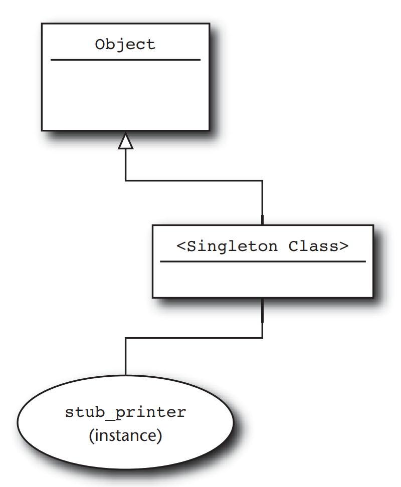

# Part I: Classes, Modules and Blocks

## Chapter 11. Define Operators Respectfully
The up part is defining operator in Ruby is very easy, the down part is actually getting that operator to work the way your users might expect it to work.

## Chapter 12. Create classes that understand equality

```ruby
class DocumentIdentifier
  attr_reader :folder, :name
  
  def initialize(folder, name)
    @folder = folder
    @name = name
  end
end
```

```ruby
x.equal?(y)
```

Should ever return true if `x` and `y` are both references to same objects.
if `x` and `y` are different objects, then `equal?` should always return false, no matter how similar x and y might be.

There is no need you to override `equal?`. Ever

### Double equal

```ruby
class DocumentIdentifier
  # ...
  def ==(other) 
    return true if other.equal?(other)
    return false unless other.kind_of?(self.class)
    folder == other.folder && name == other.name
  end

end
```

### Triple Equals for Case Statement

```ruby
location = 'area 51'

case location
when /area .*/
  # ...
when /rosswell.*/
  # ...
else 
end
```

By default, `===` calls the double equals method, so, unless you override `===`, whenever you send `==`, `===` is sure to follow.
It's probably a good idea to leave `===` alone, unless doing so really ugly case statements.

### eql? and Hash Table

```ruby
class DocumentIdentifier
  # ...
  def hash
    folder.hash ^ name.hash
  end 
  
   def eql?(other)
    return false unless other.instance_of?(DocumentIdentifier)
    folder == other.folder && name == other.name
   end
end
```

## Chapter 13. Get the Behavior You Need with Singleton and Class Methods

**Singleton method** is a method that is defined for exactly one object instance.

The key is every Ruby object carries around a additional, somewhat shadowy class of its own. A **singleton class** sits between every object and its regular class.


```ruby
hand_built_stub_printer = Object.new

def hand_built_stub_printer.available?
  true
end

def hand_built_stub_printer.render(content)
  nil
end

hand_built_stub_printer.available? # => true
hand_built_stub_printer.render('printer') # => nil
```

Singleton methods override any regular, class-defined method.

```ruby
uncooperative = "Don't ask my class"
 
def uncooperative.class
  "I'm not telling"
end

uncooperative.class # => I'm not telling
```

### Class methods
All classes in Ruby is a instance of class `Class`, so, when we need to create independent methods for these classes, we add singleton methods like this:
```ruby
Document = Class.new

def Document.explain
  puts "self is #{self}"
  puts "and its class is #{self.class}"
end

Document.explain 
# => self is Document
# => and its class is Class
```

## Chapter 14. Use Class Instance Variables

```ruby
class Resume < Document
  @@default_font = :arial
  
  class << self
    def default_class=(font)
      @@default_font = font
    end
    
    def default_font
      @@default_font
    end
  end
end
```

When `@@default_font = :arial` get runs, Ruby will look at the `Resume` class and right on up the inheritance tree. Finding no `@@default_font` defined anywhere, Ruby will set `@@default_font` on `Resume` class.

Now we have another class
```ruby
class Presentation < Document
  @@default_font = :nimbus
  
  class << self
    def default_font=(font)
      @@default_font  = font
    end
    
    def default_font
      @@default_font
    end
  end
end
```
 
Again, Ruby will look up `@@default_font` on `Presentation` class (nope) and then `Document` class (no again), and it finishes by set `@@default_font` in `Presentation` class.

After all, we have a two dependent classes have two dependent `@@default_font` variables.
But, the problem comes, when we define `@@default_font` on `Document` class:

```ruby
class Document
  @@default_font = :times
end
```

The `Document` class needs to be loaded first, before `Resume` and `Presentation` class, so, `Document` class `@@default_font` variable will get sets first.
which means, whenever subclass goes looking for `@@default_font` it will find the one in `Document`.
So, instead of two separated default font variables, one is attached to Resume, one is Presentation, now, only one variable that lives up in the Document class.

```ruby
require 'document'
require 'resume'
require 'presentation'
puts Resume.default_font # => :nimbus (not :arial anymore)
```

The alternative way is class instance variable instead of class variable.

```ruby
class Document
  @default_font = :arial
  
  class << self
    def default_font=(font)
      @default_font = font
    end
    
    def default_font
      @default_font
    end
  end
  
  attr_accessor :font
  
  def initialize
    @font = Document.default_font
  end
end
```

### Getter and setter for Class instance variable
```ruby
class Document
  @default_font = :arial

  class << self
    attr_accessor :default_font
  end
end
```

## Chapter 15. Use Module as Namespace

## Chapter 16. Use Module as Mixins

```ruby
class Finders
  def find_by_name(name)
    # Find a document by name
  end
  
  def find_by_id(doc_id)
    # Find a document by its id
  end
end
```

```ruby
class Document
  class << self
    include Finders
  end
end
```

or by a shorter way
```ruby
class Document
  extend Finders
end
```

# Part III - Metaprogramming

## Chapter 20. Use Hooks to Keep Your Program Informed

### How to add both instance methods and class methods with `include`

```ruby
module UsefulMethods
  module ClassMethods
    def a_class_method
    end
  end
  
  def self.included(host_class)
    host_class.extend(ClassMethods)
  end
  
  def an_instance_method
  end
end

class Host
  include UsefulMethods
end
```

Ultimate hook: `set_trace_func`

`$!` is a global variable that Ruby sets to the last exception raised.

## Chapter 21. Use `method_missing` for Flexible Error Handling

## Chapter 22. Use `method_missing` for Delegation

## Chapter 23. Use `method_missing` to Build Flexible APIs

## Chapter 24. Update Existing Classes with Monkey Patching
